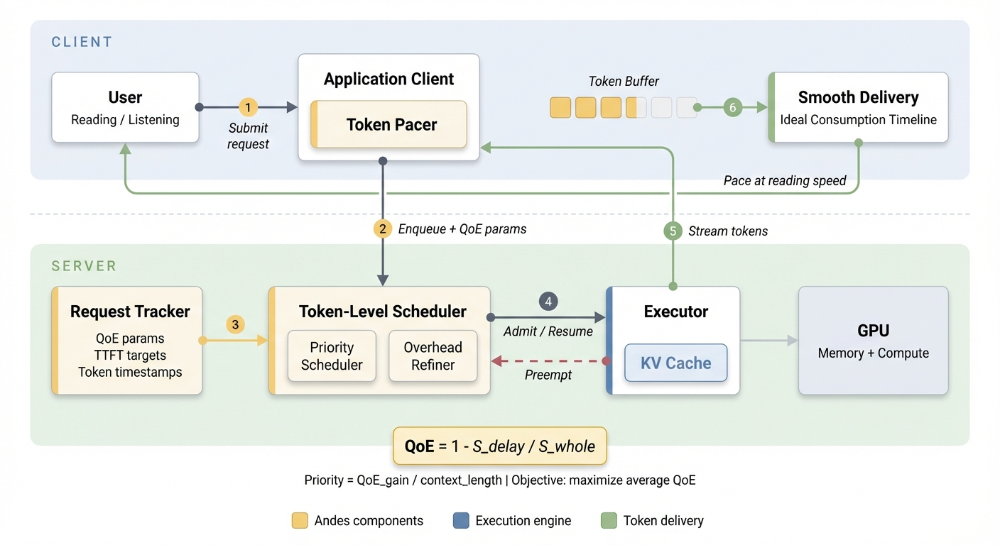
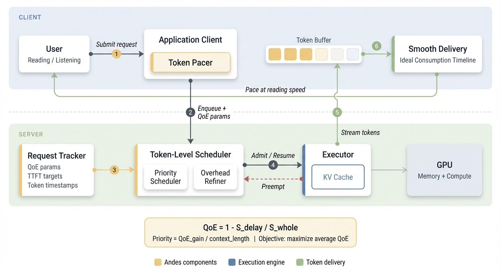
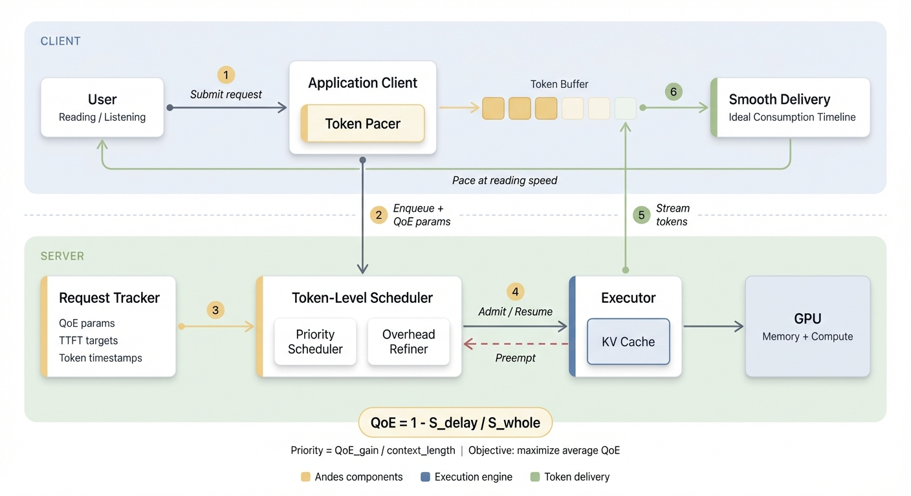
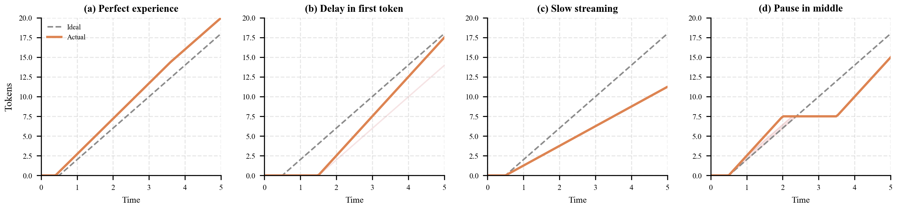
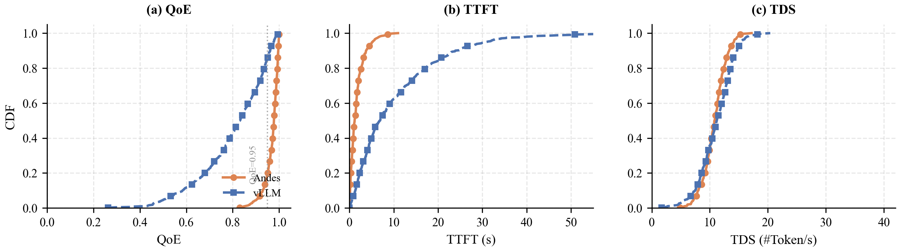
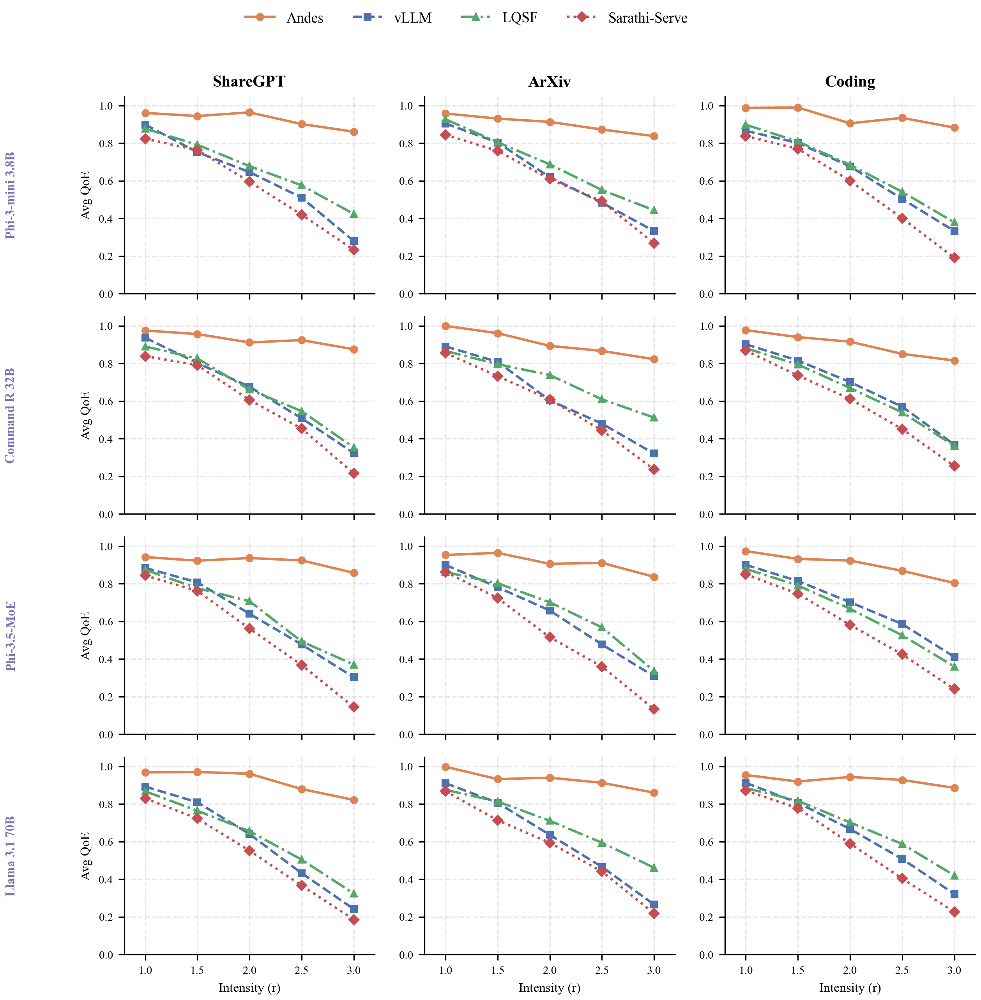
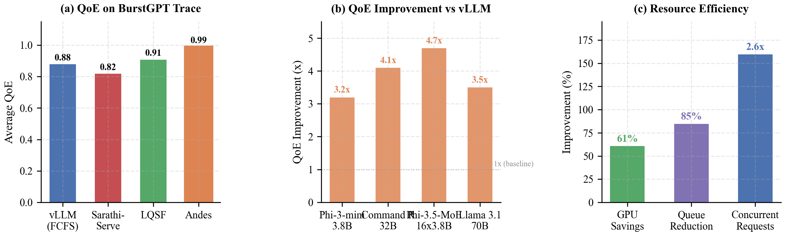

# Academic Plotting Skill Demo

> Publication-quality figures generated using the **academic-plotting** skill from the [AI Research Skills](https://github.com/Orchestra-Research/AI-Research-SKILLs) library. Demonstrates both **Gemini AI diagram generation** (Workflow 1) and **matplotlib/seaborn data charts** (Workflow 2).

---

## Source Paper

**[Andes: Defining and Enhancing Quality-of-Experience in LLM-Based Text Streaming Services](https://arxiv.org/abs/2404.16283)**

*Jiachen Liu, Jae-Won Chung, Zhiyu Wu, Fan Lai, Myungjin Lee, Mosharaf Chowdhury*

> Andes is a QoE-aware LLM serving system that enhances user experience by ensuring users receive tokens promptly and at a smooth, digestible pace. Its preemptive token-level request scheduler dynamically prioritizes requests based on expected QoE gain and GPU resource usage, achieving up to **4.7x** QoE improvement or **61%** GPU savings compared to existing systems.

| Metric | Result |
|--------|--------|
| QoE improvement over vLLM | **4.7x** |
| GPU resource savings | **61%** |
| Peak queue length reduction | **85%** |

---

## 1. System Architecture Workflow (Gemini AI)

Core contribution diagram showing Andes' co-design of the inference server (Token-Level Request Scheduler + Overhead-Aware Refiner) and client (Token Pacer). Generated using the updated academic-plotting skill:

- **Model**: `gemini-3-pro-image-preview`
- **Style**: Style B "Modern Minimal" — ultra-clean, spacious, authoritative
- **Palette**: "Nord" — desaturated section fills, Aurora Yellow accents for Andes components
- **Prompt**: 6-section structure (Framing, Visual Style, Colors, Layout, Connections, Constraints)
- **Attempts**: 3 non-deterministic, best selected

### Selected Result (Attempt 1)


**Figure 1: Andes QoE-Aware LLM Serving System Architecture**

AI-generated diagram showing the full request lifecycle: (1) User submits request, (2) Client enqueues with QoE parameters, (3) Request Tracker feeds state to scheduler, (4) Token-Level Scheduler admits/resumes/preempts at token granularity, (5) Executor streams tokens, (6) Token Pacer delivers smoothly at reading speed. Yellow-accented components are Andes' novel contributions.

`gemini-3-pro-image-preview` | `Style B: Modern Minimal` | `Nord Palette` | `Best of 3`

### All 3 Gemini Attempts (for comparison)

| Attempt 1 (Selected) | Attempt 2 | Attempt 3 |
|:--------------------:|:---------:|:---------:|
|  |  |  |
| Best spacing, color accents, arrow routing | Good, slightly tighter spacing | Good separation, dashed preempt |

All 3 attempts have **100% text accuracy** — every label spelled correctly (Token Pacer, Overhead Refiner, KV Cache, etc.). This is a major improvement over the previous generation which had misspellings in all attempts.
 
---

## 2. QoE Metric Definition

Four foundational cases illustrating how the QoE metric captures different types of user experience degradation in text streaming services.



**Figure 2: User Experience Cases and QoE Definition**

(a) Perfect experience: actual delivery matches ideal consumption timeline. (b) Long initial delay: head-of-line blocking inflates TTFT. (c) Slow streaming: token generation slower than consumption speed. (d) Pause in middle: preemption causes mid-stream pause. The shaded area represents QoE degradation (S_delay).

`matplotlib` | `Line Plot`

---

## 3. CDF Comparison: QoE, TTFT, TDS

Three-panel CDF comparison on real-world BurstGPT traces showing Andes' improvements across all key metrics. Follows the multi-panel figure pattern with shared styling and colorblind-safe colors.



**Figure 3: CDF of QoE, TTFT, and TDS on BurstGPT Trace**

Andes (orange) achieves near-perfect QoE for 97% of requests (QoE >= 0.95), compared to only 75% for vLLM (blue). TTFT is reduced from 10.5s to 1.8s average. TDS remains comparable, showing Andes doesn't sacrifice throughput.

`matplotlib` | `CDF Plot` | `PDF + PNG`

---

## 4. Multi-Panel: Varying Burst Intensity

4x3 grid showing average QoE across 4 models and 3 datasets under varying burst intensities. This demonstrates the academic plotting skill's ability to create complex multi-panel figures with shared axes, model labels, and a unified legend.



**Figure 4: Average QoE Under Varying Burst Intensity**

Across all 12 model-dataset combinations, Andes (orange) consistently maintains higher QoE than all baselines as burst intensity increases. vLLM (blue), LQSF (green), and Sarathi-Serve (red) degrade significantly under heavy bursts due to FCFS scheduling and head-of-line blocking. Andes achieves up to 4.7x improvement at the highest burst intensity.

`matplotlib` | `Multi-Panel Grid` | `4 Methods x 4 Models x 3 Datasets`

---

## 5. Summary: Key Improvements

Three-panel bar chart summarizing the headline results from the paper. Each panel uses a distinct color to represent different aspects of improvement.



**Figure 5: Summary of Key Improvements**

(a) Andes achieves 0.99 average QoE vs 0.88 for vLLM on real-world traces. (b) QoE improvement ranges from 3.2x to 4.7x across different model architectures. (c) Andes saves 61% GPU resources, reduces peak queue by 85%, and handles 2.6x more concurrent requests.

`matplotlib` | `Grouped Bar` | `PDF + PNG`

---

## 6. How These Figures Were Generated

All figures follow the **academic-plotting** skill's two workflows and publication standards.

### Workflow 1: Gemini AI Diagram

The system architecture (Figure 1) uses `gemini-3-pro-image-preview` with the skill's **6-section prompt structure** and **Style B: Modern Minimal** visual style. Key elements:

1. **Framing** — Sets the tone: "ultra-clean, modern, authoritative, like Apple docs meets Nature paper"
2. **Visual Style** — Full Modern Minimal style block: floating boxes with shadow, no borders, thin gray arrows
3. **Color Palette** — Nord palette with exact hex codes for every element
4. **Layout** — Every box named, spatially positioned, with nested sub-components
5. **Connections** — Every arrow individually specified: source, target, style, color, label, routing
6. **Constraints** — What NOT to include, adapted for the Modern Minimal style

```python
from google import genai
client = genai.Client(api_key=API_KEY)

# 6-section prompt: Framing + Style + Colors + Layout + Connections + Constraints
PROMPT = """
SECTION 1 — FRAMING:
Create an ultra-clean, modern technical architecture diagram for an OSDI paper.
Think: Apple developer docs meets Nature paper...

SECTION 2 — VISUAL STYLE (Modern Minimal):
Ultra-clean geometric shapes, floating boxes with shadow, thin gray arrows...

SECTION 3 — COLOR PALETTE (Nord):
Deep text: #2E3440, Andes accent: Aurora Yellow #EBCB8B, Executor: Frost #5E81AC...

SECTION 4 — LAYOUT:
Two zones: CLIENT (#EEF1F6) and SERVER (#EDF3ED), each with floating boxes...

SECTION 5 — CONNECTIONS:
8 arrows with step numbers, dashed red preempt path, green delivery flow...

SECTION 6 — CONSTRAINTS:
ZERO decoration, generous whitespace, CRITICAL TEXT ACCURACY...
"""

# Generate 3 non-deterministic attempts
for i in range(1, 4):
    response = client.models.generate_content(
        model="gemini-3-pro-image-preview",
        contents=PROMPT,
        config=genai.types.GenerateContentConfig(
            response_modalities=["IMAGE", "TEXT"]))
```

### Workflow 2: Data-Driven Charts

Experiment figures use matplotlib with publication defaults: serif fonts, colorblind-safe palette, 300 DPI export, venue-appropriate sizing. Each figure exports both PDF (vector for LaTeX) and PNG (raster).

```python
# Publication defaults
plt.rcParams.update({
    "font.family": "serif",
    "font.size": 10,
    "axes.spines.top": False,
    "savefig.dpi": 300,
})

# Colorblind-safe palette
COLORS = {
    "blue": "#4C72B0",
    "orange": "#DD8452",
    "green": "#55A868",
    "red": "#C44E52",
}
```

---

## 7. Generated Files

```
demo/
├── README.md                                # This demo page
└── figures/
    ├── gen_fig_andes_architecture_gemini.py  # Gemini diagram script (Workflow 1)
    ├── gen_fig_andes_workflow.py             # matplotlib diagram (alternative)
    ├── gen_fig_experiment_results.py         # Data charts script (Workflow 2)
    ├── fig_andes_architecture.png            # Gemini best attempt (selected)
    ├── fig_andes_architecture_attempt1.png   # Gemini attempt 1
    ├── fig_andes_architecture_attempt2.png   # Gemini attempt 2
    ├── fig_andes_architecture_attempt3.png   # Gemini attempt 3
    ├── fig_andes_workflow.pdf                # matplotlib vector diagram
    ├── fig_andes_workflow.png                # matplotlib raster diagram
    ├── fig_cdf_comparison.pdf               # CDF panels (vector)
    ├── fig_cdf_comparison.png               # CDF panels (raster)
    ├── fig_burst_intensity.pdf              # Multi-panel grid (vector)
    ├── fig_burst_intensity.png              # Multi-panel grid (raster)
    ├── fig_qoe_definition.pdf              # QoE illustration (vector)
    ├── fig_qoe_definition.png              # QoE illustration (raster)
    ├── fig_summary_improvements.pdf         # Summary bars (vector)
    └── fig_summary_improvements.png         # Summary bars (raster)
```

---

*Generated using the [academic-plotting](../20-ml-paper-writing/academic-plotting/SKILL.md) skill from [AI Research Skills](https://github.com/Orchestra-Research/AI-Research-SKILLs). Paper: [arXiv:2404.16283](https://arxiv.org/abs/2404.16283). Figures use synthetic data matching paper-reported distributions.*
